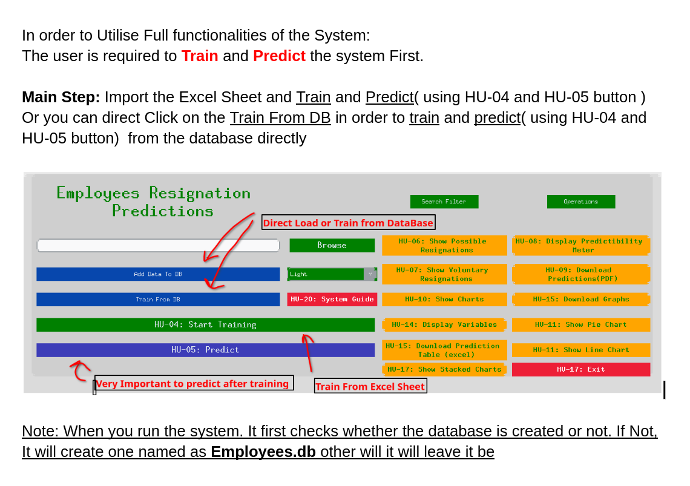

# Employees-Resignation-System

### Employee Resignation Project Overview

This project is a comprehensive walkthrough that involves Machine Learning, Backend, and User Interface sections for employee resignation prediction. Below is a detailed breakdown of each segment:

### 1. Machine Learning
The Machine Learning component encompasses three main sections:
- **Data Preprocessing:**
  - Conversion of raw data (string values, categorical columns, and datetime values) into integers suitable for the machine learning model.
  - Label encoding using the Pandas library and separation of employee joining dates into day, month, and year columns.
  - Handling null rows and dropping unnecessary columns for model preparation.
- **ML Model (Random Forest):**
  - Utilization of a random forest model using the Scikit-Learn library.
  - Training the model with specified parameters.
- **Model Evaluation:**
  - Assessing model performance based on precision, recall, and accuracy matrices.

### 2. Backend
The Backend is divided into various sections, closely interconnected with the User Interface to enable functionalities for different buttons:
- **GUI:** The primary dashboard section links various tabs such as Database Operations, Search Filters, and Graph Operations. Each button triggers specific functions associated with these tabs.
- **Resignation Prediction:** Core functionality includes data preprocessing, training, prediction, and classification reporting. A class-based approach enables independent access to these processes.
- **Search Filter (Popup):** Construction of search filters for age, gender, predicted resignations, and age range.
- **Database Operations:** Handling database interactions, including insert, show table, delete specific records, and more.

### 3. User Interface
The User Interface is divided into four main components:
- **Data Loading:** Buttons for adding data to the database, training from the database, starting training, and prediction.
- **Data Analysis:** Options for displaying potential resignations, predictability metrics, voluntary resignations, and various data visualization operations (e.g., charts, graphs, and downloading prediction data).
- **Data Filter:** Filtering operations by age, resignation status, gender, and age range.
- **Data Operations:** Functionalities such as inserting worker data, displaying, editing, and deleting data.

### Key Notes
- The project structure is designed for ease of use and efficiency.
- Interactivity between Backend and User Interface sections is emphasized for streamlined operations.
- The detailed breakdown showcases the specific functionalities and operations each section provides.

This comprehensive architecture allows users to interact with the system, load data, perform predictions, analyze results, and interact with the database with ease, providing a holistic approach to managing employee resignation predictions.

User Interface

